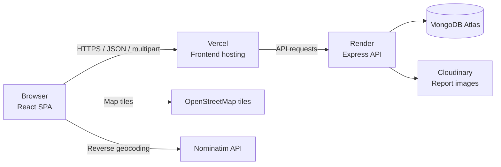
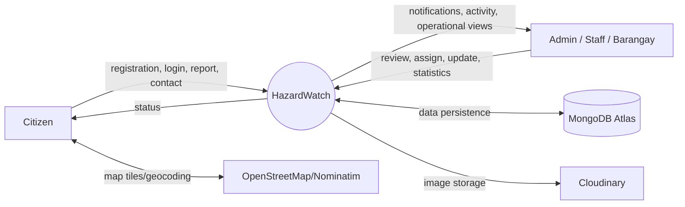
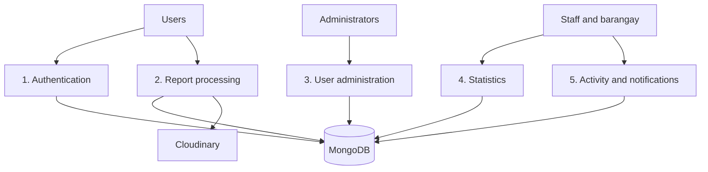
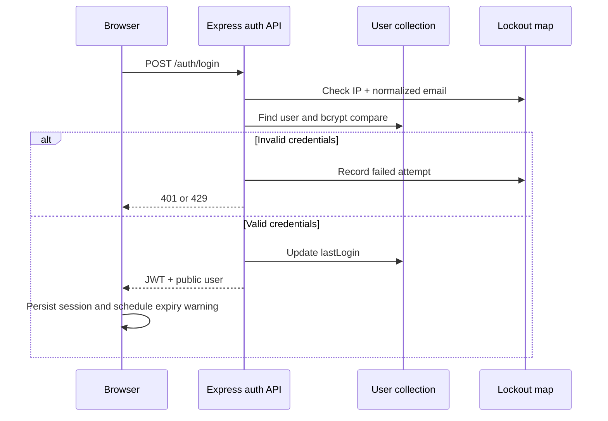
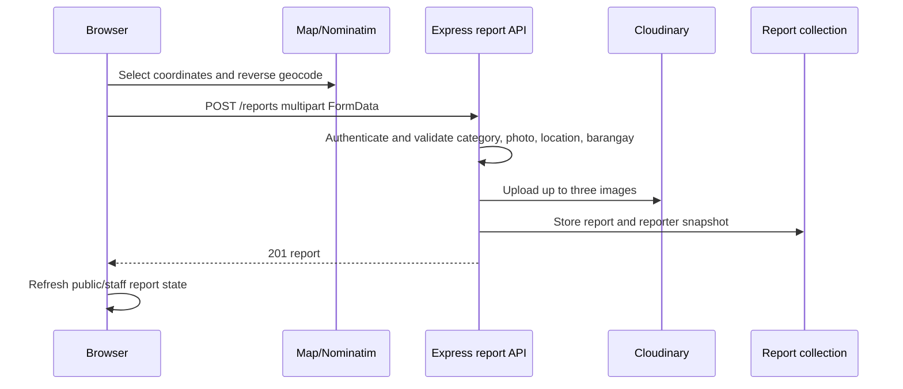

# HazardWatch Architecture and Data-Flow Diagrams

## System architecture

The browser loads the React/Vite SPA from Vercel. Axios sends authenticated JSON or multipart requests to the Express API on Render. The API persists data in MongoDB Atlas and stores report images in Cloudinary. MapLibre loads OpenStreetMap tiles and the browser calls Nominatim for reverse geocoding.

## DFD Level 0: Context

## DFD Level 1: Main processes

## DFD Level 2: Login flow

## DFD Level 2: Report submission flow

## Evidence and export notes

The Mermaid source above is the editable diagram source. PNG exports should be generated from the Mermaid blocks using Mermaid CLI, Draw.io, or another approved diagram editor and stored as:

- `docs/architecture-diagram.png`
- `docs/dfd-level-0.png`
- `docs/dfd-level-1.png`
- `docs/dfd-level-2.png`

The repository currently documents the diagrams in editable Markdown; PNG evidence must be generated in the authorized workstation/tooling environment.
